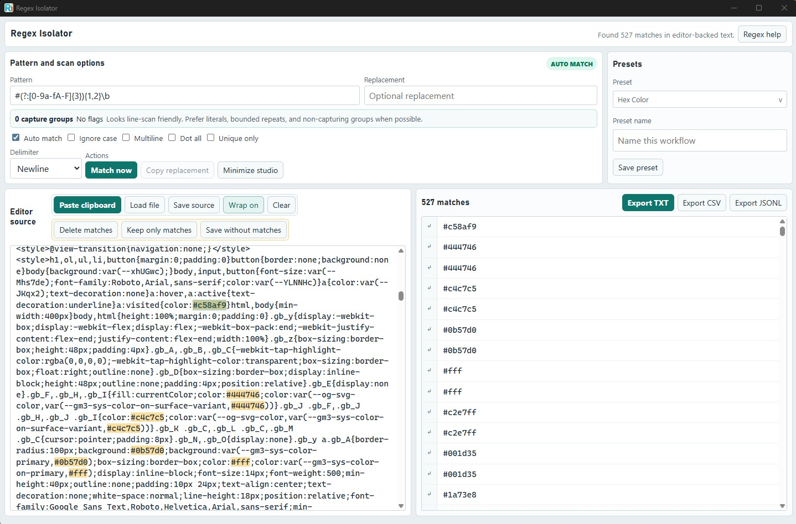

# Regex Isolator

Regex Isolator is a desktop-first regex workbench for quickly extracting, inspecting, transforming, and exporting matches from text. It runs as a React/Vite app in the browser during development and as a Tauri 2 app with a Rust scan backend for local-file workflows.

## Screenshot



## Windows Download

If you just want to use Regex Isolator on Windows, download the latest setup executable from the latest release.

- Recommended download: `Regex Isolator_<version>_x64-setup.exe`
- Portable fallback: `regex-isolator-desktop.exe`

The setup executable is the best option for most people because it:

- installs the app into your user profile without requiring administrator rights
- creates the normal Windows shortcuts and uninstall entry
- checks for the Microsoft Edge WebView2 runtime and installs or updates it when needed

You do not need Node.js, Rust, or Tauri to use a release build.

## Install on Windows

1. Download the latest `Regex Isolator_<version>_x64-setup.exe` from the latest release.
2. Run the installer.
3. Launch Regex Isolator from the Start menu.

If WebView2 is already installed, setup is effectively just the app install. If it is missing or out of date, the installer handles that dependency for you.

## Highlights

- Editor-backed regex scanning with source-side match highlighting and result-click jump navigation.
- Large-file mode that keeps files over 16 MiB on disk and scans them line by line from Rust.
- Fast regex engine path with a `fancy-regex` fallback for advanced constructs such as lookaround.
- Collapsible Pattern Studio with flags, delimiter controls, replacement copy, custom presets, and regex help.
- Result exports as TXT, CSV, or JSONL.
- Source transforms to delete matches or keep only full matches in the editor.
- Save source text or save a copy with current matches removed.
- Local preset storage for repeatable extraction workflows.

## Project Layout

```text
.
├── README.md
└── desktop/
    ├── src/             # React UI
    ├── src-tauri/       # Tauri shell and Rust scanner
    ├── scripts/         # icon and Windows release helpers
    └── package.json
```

## Build From Source

These requirements only apply if you are developing or building Regex Isolator yourself.

### Requirements

- Node.js and npm
- Rust toolchain 1.82 or newer
- Tauri system dependencies for your platform

### Quick Start

```bash
cd desktop
npm install
npm run dev
```

The Vite dev server runs the browser version at `http://localhost:1420`.

To run the packaged desktop app in development:

```bash
cd desktop
npm run tauri dev
```

### Build

Build and type-check the web UI:

```bash
cd desktop
npm run build
```

Check the Rust scanner and Tauri commands:

```bash
cd desktop
cargo check --manifest-path src-tauri/Cargo.toml
```

Create a Windows installer:

```bash
cd desktop
npm run build:installer
```

The installer output is staged at:

```text
desktop/artifacts/installer/
```

Create a portable Windows executable:

```bash
cd desktop
npm run build:portable
```

The portable output is staged at:

```text
desktop/artifacts/portable/regex-isolator-desktop.exe
```

## Large-File Behavior

- Files up to 16 MiB load into editor mode, where highlighting, result jumps, replacements, and source transforms work against the full text.
- Larger files stay on disk and use Rust line-based scanning to avoid loading the whole source into memory.
- Dot All and true cross-line patterns require editor mode because file and directory scans process one line at a time.
- Result display is capped for responsiveness; exports include the displayed structured rows.

## Exports

- **TXT** exports the displayed match output joined by the selected delimiter.
- **CSV** exports structured rows with match text, captures, source, offsets, line/column data, and previews.
- **JSONL** exports the same structured rows as one JSON object per line.

## Release Notes

The Windows installer and portable build scripts sign staged artifacts when these environment variables are available:

```text
SIGNTOOL_PATH
WINDOWS_CERT_THUMBPRINT
WINDOWS_TIMESTAMP_URL
```

Then run:

```bash
cd desktop
npm run build:installer:signed
npm run build:portable:signed
```

Unsigned release artifacts can still be built with:

```bash
cd desktop
npm run build:installer
npm run build:portable
```

## License

MIT
